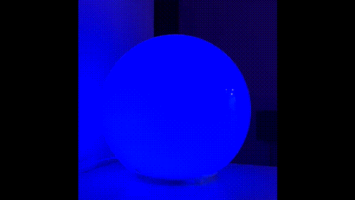
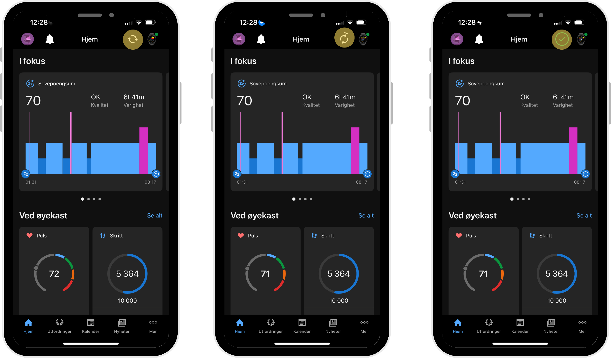
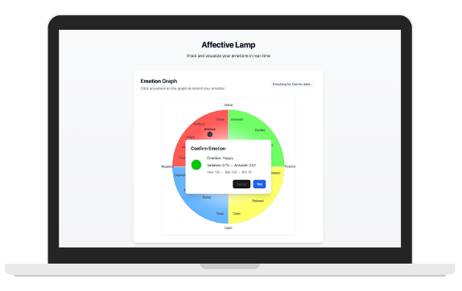

# Affective Lamp

AffectiveLamp is a real-time system that predicts emotional state (valence & arousal) from Garmin smartwatch data and reflects it through dynamic smart lighting using Philips Hue.

<p align="center">
  
</p>


## Features

- Predicts emotion from physiological signals (Garmin)
- Maps emotion to light color in real time
- Supports live emotion logging via web app
- Integrates Philips Hue smart lights

## 🛠️ Setup Instructions

### 1. Connect the Philips Hue Bridge

1. Visit [https://discovery.meethue.com/](https://discovery.meethue.com/) to find the bridge IP.  
   It returns something like:
   ```json
   [{"id":"XXX","internalipaddress":"XXX.X.XXX.X.XXX","port":80}]

2. Copy the internalipaddress and:

    Paste it into light/bridge.json
    Create a .env file in the root with:
    ```
    [BRIDGE_IP=XXX.X.XXX.X.XXX]

3. Run the script to create a Hue username
    ```
    python light/create_username.py


## 2. 💡 Connect the Bulb(s)
- Make sure your phone is connected to the same Wi-Fi network as the Hue bridge.
- Open the Philips Hue mobile app.
- Manually add and pair the light(s).

## 3. ⌚ Connect to Garmin
- Open the Garmin Connect mobile app.
- Refresh your data to sync physiological signals.
- Your backend will use this data for emotion prediction.

<p align="center">
  
</p>


## 4. 🚀 Start the app

    cd demo-app
    npm run dev

<p align="center">
  
</p>


## 📁 Directory Overview
```

    ├── demo-app/           # Frontend (React/Vite)
    ├── light/              # Philips Hue API control
    ├── models/             # Emotion prediction scripts and models
    ├── data/               # Synced Garmin data and emotion logs

Now either us ethe web app to log your emotions, or upload your data via refreshing the Garmin Connect app and wait for the prediction!
